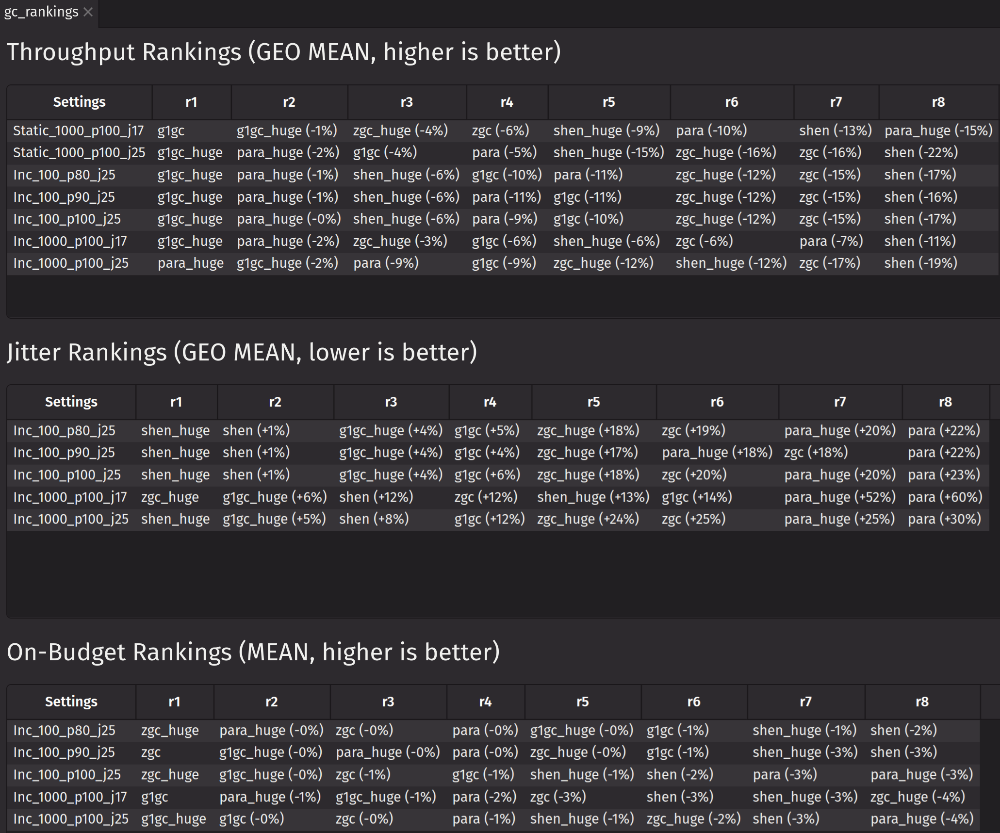
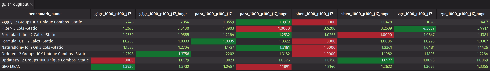
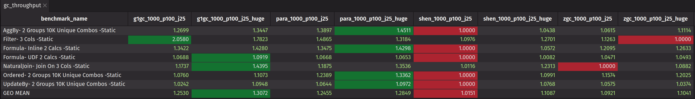
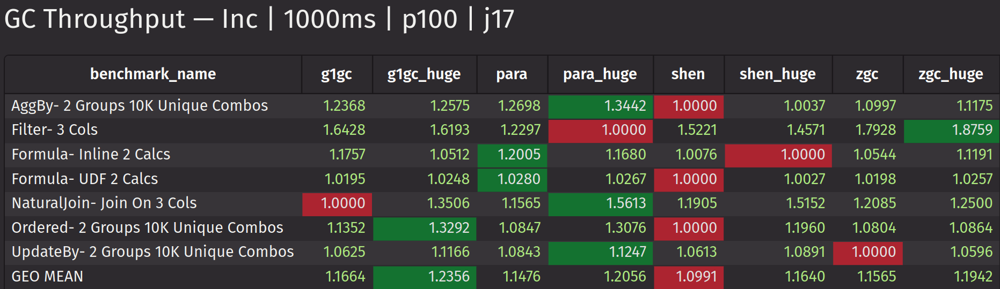
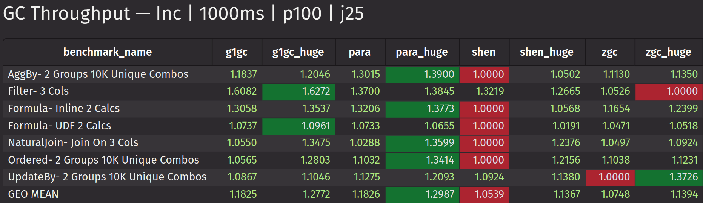
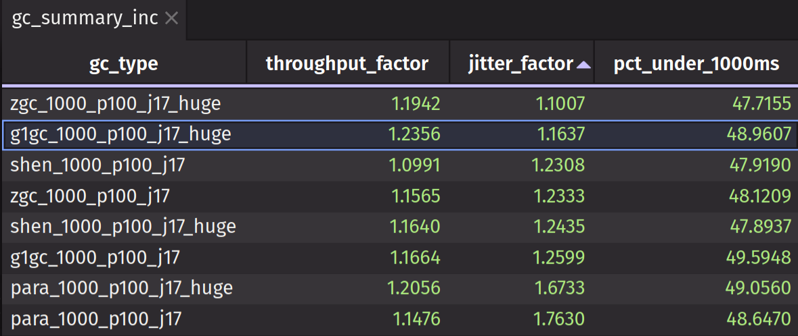
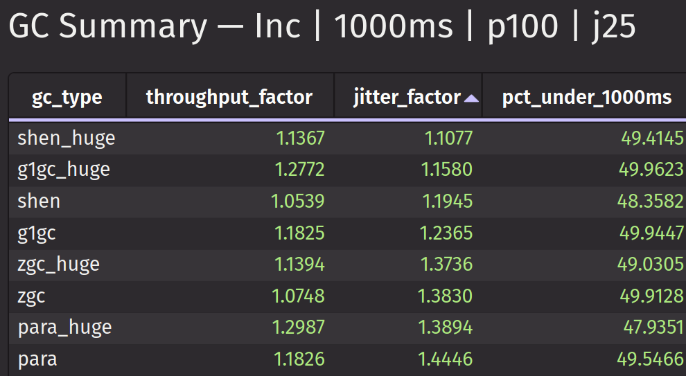
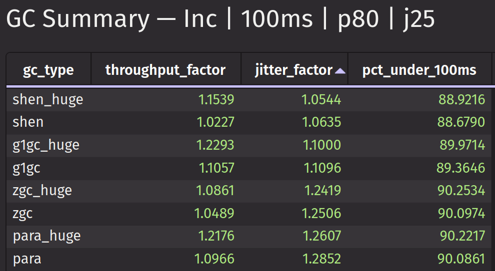
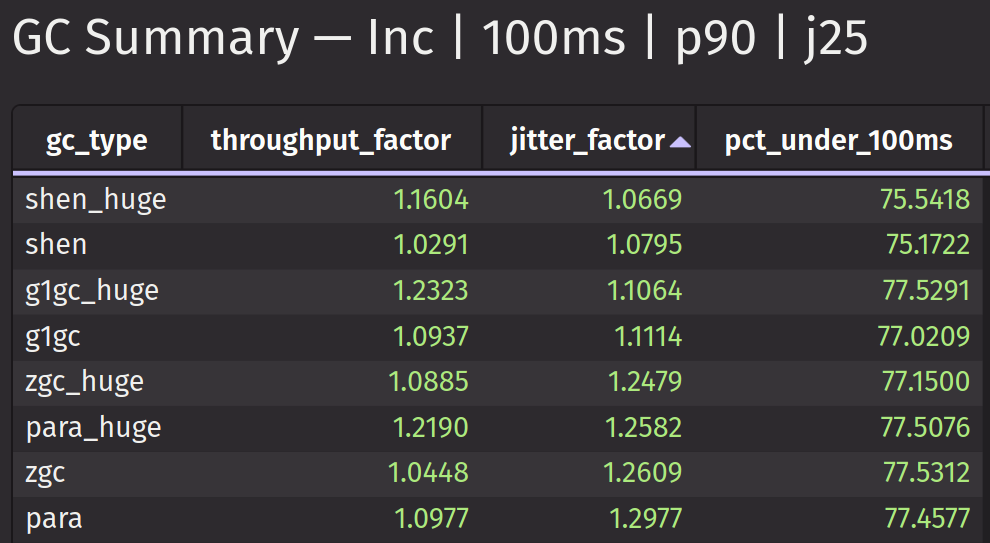
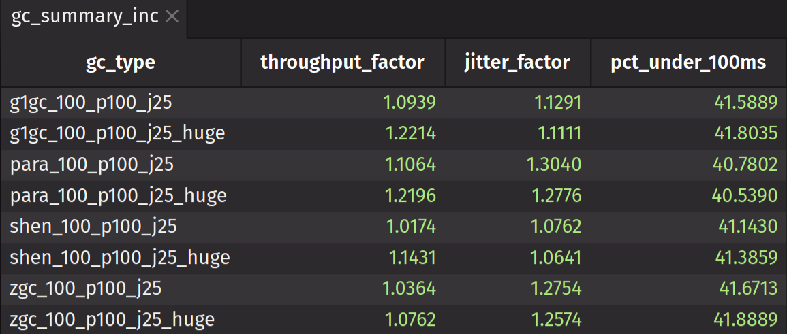

# Overview

This report provides some insight into how various Deephaven CE operations behave with different Garbage Collectors and settings. It is not possible to test every combination of JVM version, GC option, heap size, data size/cardinality, DHC operation, OS, and hardware platform. What follows are results from a small subset. Each user will have a different setup, but hopefully we can glean some useful tips from the data that has been collected.

We are covering only JVM 17 and JVM 25. This presents an interesting challenge, because GC options have changed dramatically in the four years in between. For example, ZGC generational didn't exist in JVM 17, while ZGC non-generational doesn't exist in JVM 25. The approach taken here was to use the options that will likely be the defaults in JVM 25+ and then try to use the nearest approximation in JVM 17.

One other thing to note is that, judging by recent JDK release notes, the strategy for GCs going forward is to make GCs more self-tuning. Since the GC's top priority is keeping the application running, the GC can override user-supplied settings if it needs to. The JVM options used for this effort are intentionally minimal and tend to rely more on defaults.

## TL;DR

Here are some highlights from the data:
- For best Static throughput, use G1 or G1 THP. (Others degrade by 4% to 22%)
- For best Ticking throughput, use G1, but expect higher jitter. (5% to 12% more jitter)
- For lowest jitter, use Shenandoah, though lower throughput than G1. (9% to 15% less throughput)
- For best 100ms cycle throughput-jitter compromise, use Shenandoah THP (3rd-5th best throughput, best jitter)
- For best 1sec cycle throughput-jitter compromise, use G1 THP (best throughput, 3rd best jitter)

## The Benchmarks

The benchmarks used for this effort are not the nightly benchmarks, which run single operations typically for 8 seconds. Instead a longer running and smaller benchmark set is used that covers categories of operations. This set typically runs for 1.5 to 2 mins, lazily reading from a large parquet file. The idea is to use few benchmarks to cover much of the operational code base. These are referred to as "Training Benchmarks".

- AggBy: Runs multiple mathematical operations like avg, std, var, min, max, etc
- Filter: Runs `where_in` and `where` filters
- Formula: Runs multiple UDFs and Inline Formulas
- NaturalJoin: Runs a natural join operation
- Ordered: Runs multiple aggBy ordered operations like median, unique, sorted_first, etc
- UpdateBy: Runs multiple windowed operations

## Naming Conventions

The set names for the various runs use a naming convention like `<gc-type>_<cycle-time>_<autotune-load>_<jvm>[_<extra>]`
- gc-type: `g1gc`, `shen`, `zgc`, `para`
- cycle-time: `1000` (1sec), `100` (100ms)
- autotune-load: `p80`, `p90`, `p100` (Percentage throughput targets)
- extra: `huge` (Transparent Huge Pages)

## Supporting Evidence for TL;DR

What follows are charts showing the results of many benchmarks runs using various GC options. The naming convention for the GC sets displayed have been described previously. There are three kinds of summary tables; throughput, jitter, on-budget. There is also a table that combines all three.
- Throughput: Starting with rows/sec, a normalized fraction starting from 1.0. So 1.20 would be 20% faster than 1.0.
- Jitter: Starting with Coefficient of Variation, a normalized fraction starting from 1.0. So 1.04 would be 4% more jitter than 1.0.
- On Budget: A percentage of cycles that finished on or below the cycle time (e.g. 1000ms or 100ms)

## Overall Rankings

Overall ranking can show the difference between the overall throughput, jitter, or on-budget metrics for each GC for the same configuration. For example, on JVM 25 for Static data, ZGC is 16% slower than G1.

### Static Data Throughput

The following chart shows Throughput for Static data for JVM 17. G1 comes in first with ZGC a surprising second.

The following chart shows Throughput for Static data for JVM 25. The story is similar to JVM 17 with G1 in front but followed by parallel GC.

### Ticking Data Throughput

There are three considerations captured here; throughput, jitter, and on-budget percentage. These can be weighted based on the needs of the workflow. Typically, but not always, higher throughput means higher jitter or lower on-budget percentage.

The following chart shows throughput for JVM 17 with 1s UGP cycles.

The following chart shows throughput for JVM 25 with 1s UGP cycles.

The following charts show summaries of JVM 17 and JVM 25 with three factors organized according to their ranks for the benchmarks overall. For example, the values in the "jitter" column are the geometric means for each "gc_type" set when compared to every other set in the table. This gives a ranking of each column that can provide a quicker comparison than a dozen individual tables.

<table><tr>
<td></td>
<td></td>
</tr></table>

The following charts show summaries of JVM 25 for 100ms running at an autotune target of 80%, 90%, and 100%

<table><tr>
<td></td>
<td></td>
<td></td>
</tr></table>

The data for these sets is collected in a [demo dashboard](./train-dashboard.md), which can be used for more investigation. The dashboards include Throughput tables, CDFs, CCDFs, and Time Series.

## Test Setup

- OS: Ubuntu 24.04
- Hardware: Intel(R) Xeon(R) E-2388G (8C/16T), 64G DDR4-3200, NVME drive
- OS Settings: THPMode=madvise, CPUPower=schedutil, ASLR=disabled
- Java: 48G Heap, Temurin 17 and 25
- Container: Docker Images built from a recent edge build
- Test Iterations: 7 for each benchmark
- Static Data Provider: Parquet
- Ticking Data Provider: Autotuning Incremental Release Filter from Parquet

## JVM Options

The strategy for the JVM options selected for each JVM (e.g. 17, 25) was to make them equivalent. Of course, this was impossible, because different options are supported in different versions of the same GC. For the JVM 25 options, an attempt was made to use options that will be the defaults in future versions of the JVM. Also, setting explicit thread usage is not generally recommended in JVM 25.

The JVM options and DHC properties used for these benchmarks are as follows:
- All GCs: `-Xms48g -Xmx48g -XX:+UseStringDeduplication -DPeriodicUpdateGraph.targetCycleDurationMillis=<100 or 1000>`
- Huge: `-XX:+AlwaysPreTouch -XX:+UseTransparentHugePages`
- JDK 17
  - G1GC: `-XX:+UseG1GC -XX:G1HeapRegionSize=32m -XX:+G1UseAdaptiveIHOP`
  - ParallelGC: `-XX:+UseParallelGC -XX:ParallelGCThreads=13 `
  - Shenandoah: `-XX:+UseShenandoahGC -XX:+UnlockExperimentalVMOptions -XX:+ShenandoahImplicitGCInvokesConcurrent`
  - ZGC: `-XX:+UseZGC -XX:ConcGCThreads=6`
- JDK 25
  - G1GC: `-XX:+UseG1GC -XX:+UseCompactObjectHeaders`
  - ParallelGC: `-XX:+UseParallelGC -XX:+UseCompactObjectHeaders`
  - Shenandoah: `-XX:+UseShenandoahGC -XX:ShenandoahGCMode=generational -XX:+UseCompactObjectHeaders`
  - ZGC: `-XX:+UseZGC -XX:+UseCompactObjectHeaders`
  
### What are Huge Memory Pages?

All of the benchmark sets that end with "_huge" have the options `-XX:+AlwaysPreTouch -XX:+UseTransparentHugePages`. In a nutshell, these options pair well together to initialize huge memory pages (e.g. 2MB) at JVM init. This provides better memory performance for larger heaps (> 8G) but can suffer from larger startup costs. In these benchmarks THP provided sizable throughput increases for some benchmarks like natural join in exchange for a small increase in jitter.

What about `-XX:+UseLargePages`? These have not been tested but could provide similar benefits as THP but with a faster JVM startup time, since they are preallocated during OS start. This requires strict rules, however, and is best for systems that are locked down in terms of memory configuration. It is tricky to size as well, since it is used for more than just JVM heap, and that depends on JVM version.

### What are Compact Headers?

The `-XX:+UseCompactObjectHeaders` option cuts the Java Object header in half (16 to 8 bytes, or 12 to 8 for < 32G heaps) to reduce object footprint and improve cache utilization. Systems that use lots of small objects can benefit with better throughput. Minimal testing for Deephaven showed no significant change in performance, but the option will be a default in JVM 26+.

## Improvements for Better Benchmarks

- Is the AutoTuningIncrementalReleaseFilter really the best way to simulate ticking data?
  - Bases the next UGP load on the previous cycle, so one data point decides throughput calculation
    - Allow a function for the load target instead of a fraction?
  - Reads whatever data is available from a source table until data is exhausted
    - Allow a repeating set that runs for X amount of seconds?
- Is there a better set of benchmarks to get more coverage with fewer benchmarks?
  - Use groupBy with one category (e.g. AggBy Math), and no groups with another (e.g. Ordered)?
  - Are both UDF and inline benchmarks needed?
- Do we need to collect all of the defined UGP cycle events?
  - Discard the first two and last one UGP cycle
- Do we need wider tables?
  - Increase the table width from a few columns to 20 or 30?
    
## Needed for Further Investigation

In order to improve investigations like this one, we need much more information on how customers are using Deephaven. Without violating any NDA, we should be able to produce the following:

- Query structure and complexity like a flow chart for the table chains
- General order of operations. Do they filter first, then agg, then sort?
- Static and ticking schema width, column types, and value cardinality
- Complexity of inline formulas and UDFs
- Type of hardware and containerization
- Java heap and CPU thread count typically used
- Where the data typically comes from. DHE live tables? Kafka? Parquet?
- What JVM options have already been tried in the field?
- What queries are running all day vs frequent/short on a schedule

- Get some Tail information
- Run benchmarks with smaller heaps until failed then 25% of that
  - G1 and Shenandoah
- Try collecting PyObjects
