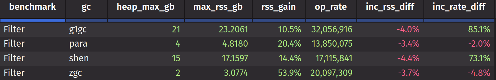
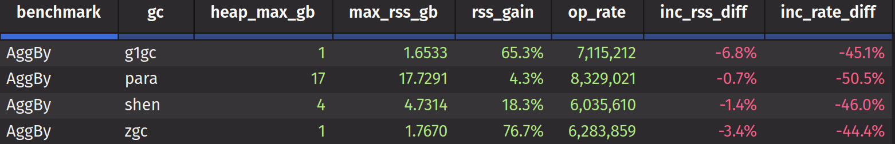
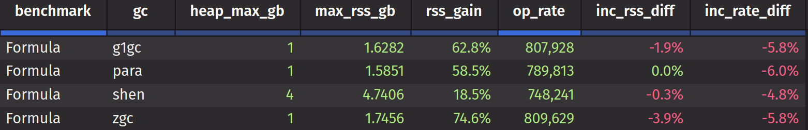
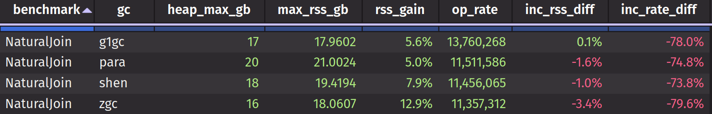
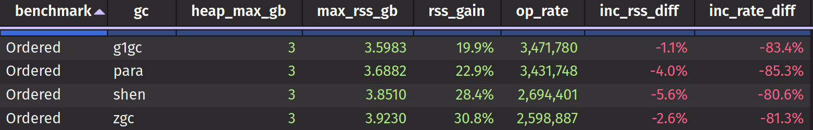

# Overview

We [previously documented](../gc/gc-report.md) what GC types had the fastest throughput for both Static and Incremental for the "training" benchmarks. G1 fared very well in these tests. Even Shenandoah fared well for 100ms cycles. However, these benchmarks were all run at high max Java heap (e.g. 48G).

This study attempts to understand how well each GC uses heap for each operational category. The results are surprising and may necessitate changes in some of our operations. For example, G1 gets an extremely fragmented heap during Filter operations. So while it is very fast, it takes a large amount of memory compared to ZGC, which uses little memory but is slower. These trade-offs need to be understood so that customers, for example, could run some PQs on slower, smaller-memory workers, and others on faster, larger-memory workers.

Notes about this analysis:
- Much of it comes from AI parsing through JFR profiling data that was collected from Static runs for each operational category.
- The tests are looking at heap pressure, meaning we run each benchmark in nearly as small a heap as possible without crashing.
- All benchmarks read from a parquet file, so it is a factor in the heap in addition to what the benchmark operations do.

## Filter Operations

This category encompasses the "Where*" set of operations. In order to improve parallelism and avoid locking, the are lots of copies on row sets. G1 does not handle this well. Its heap becomes extremely fragmented and without a large amount of heap overhead available it quickly falls behind.

### Filter Allocation Behavior

Deephaven's parallel initial filter (`InitialFilterExecution`) processes the entire static table in a single pass, splitting it into N parallel segments. For a large table read statically, this creates a massive simultaneous allocation burst. All of the following are live at the same time across N threads:

- **N RowSet subsets** — one per parallel segment via `subSetByPositionRange()`
- **N per-segment filter results** — each `WhereFilter.filter()` call returns a new `WritableRowSet`
- **Intermediate copies** — full input RowSet clone, result accumulator
- **Internal RowSet builders** — within each filter implementation

Because the entire table is processed in one pass, the peak live set of temporary objects is proportional to **full table size × parallelism factor**. These temporaries are allocated across threads, interleaved with long-lived result objects (the final filtered RowSet, column data), and then all die at once when the filter completes.

For ticking data the problem is the same, except that the bursts are smaller and there are more of them.

### Filter GC Handling

- G1 (21G Xmx): region fragmentation + mixed GC strategy leaves garbage in uncollected old-gen regions + evacuation headroom. It can't reclaim memory fast enough without massive overhead.
- Shenandoah (15G Xmx): concurrent compaction but still has region overhead and forwarding pointers.
- Parallel (4G Xmx): STW full compaction leaves zero fragmentation. Very efficient.
- ZGC (2G Xmx): concurrent compaction with colored pointers, immediate memory reuse. Almost no overhead.

### Filter Results

- Throughput (op_rate): G1 wins when it has enough heap
  - G1 at 32M is ~60% faster than ZGC at 20M. This is the classic G1 tradeoff if you give it enough memory, it's fast. But "enough" is 10x more than ZGC for this workload.
- RSS gain: ZGC grows the most
  - ZGC's 54% rss_gain vs G1's 10.5% is likely ZGC's multi-mapped colored pointer overhead. At 2GB heap → 3.1GB RSS, that's ~50% native/mapping overhead. G1's RSS is only 10% over heap because its overhead is inside the heap (wasted regions), not outside.
- Incremental (ticking) behavior
  - inc_rss_diff — all negative (~3-4 GB less RSS for ticking). Consistent with ticking data processed incrementally, which avoids the spike of materializing the full static table at once.
  - inc_rate_diff — G1 (+85%) and Shenandoah (+73%) are much faster ticking than static. This suggests their static runs are hitting severe GC pressure (full GCs, long pauses) that tanks throughput. Ticking avoids the memory spike, so they perform better. Parallel and ZGC show negligible difference because they're not memory-stressed.

### Bottom Line for Filters

G1's throughput advantage only exists because of high available heap. ZGC delivers 63% of G1's throughput at 10% of the heap. That's the real tradeoff for customers in memory-constrained containers.

## AggBy Math Operations

This category encompasses the "AggBy" set of math operations like avg and std. Unlike Filter, which produces fragmented long-lived RowSet objects, AggBy produces mostly short-lived chunk arrays (`int[]`, `double[]`) during computation. This fundamentally different allocation pattern reverses the GC rankings.

### AggBy Allocation Behavior

AggBy operations allocate heavily during computation but most objects are ephemeral. JFR sampling across all four GCs shows ~40GB total allocation per run, dominated by:

- **`int[]` (58-65%)** — chunk index arrays, aggregation state vectors
- **`double[]` (15-29%)** — aggregation result buffers (avg, std computation)
- **`byte[]` (4-15%)** — Parquet read buffers
- **`String[]` (4-15%)** — column key arrays

These are allocated in bursts during each aggregation pass, used briefly, then discarded. The objects are uniform in size (chunk-sized, typically 2K-4K elements) and short-lived. This is the textbook case for generational GC: allocate in eden, collect cheaply in young-gen, rarely promote.

### AggBy GC Handling

- G1 (1G Xmx): generational collection excels — 555 young GCs at 3.3ms avg handle the churn. Old-gen still stressed (70 full GCs, 1182 evacuation failures, 39 concurrent mode failures), but young-gen absorbs enough that throughput remains high. GC consumes ~13% of wall time, with 4.3% in STW pauses.
- Parallel (17G Xmx): only 24 collections total, each expensive (avg 214ms STW). Needs massive heap to avoid frequent collection. GC consumes only ~3% of wall time, but 100% of that is STW.
- Shenandoah (4G Xmx): concurrent collection handles churn well (806 concurrent GCs), but heap stays \~89% full (3.6GB/4GB). GC consumes ~9% of wall time, with only 0.4% in STW pauses.
- ZGC (1G Xmx): generational and concurrent. At 1G the heap is perpetually saturated (avg 930MB/1024MB). 371 allocation stalls totaling 2.4% of wall time where application threads block completely. Total GC overhead is ~19% of wall time despite near-zero STW.

### AggBy Results

- Throughput (op_rate): Parallel wins on raw speed, G1 wins on efficiency
  - Parallel at 8.3M needs 17G heap to get there. G1 at 7.1M achieves 85% of that throughput at 1G heap — a 17x better memory-to-throughput ratio. ZGC (6.3M) and Shenandoah (6.0M) are close to each other.
- RSS gain: ZGC has the most overhead relative to heap, Parallel the least
  - ZGC's 76.7% rss_gain at 1G heap (→ 1.77GB RSS) is its multi-mapped colored pointer overhead. G1's 65.3% gain is internal fragmentation from evacuation failures and humongous regions. Parallel at 4.3% is nearly flat because its huge heap dwarfs native overhead.
- Incremental (ticking) behavior
  - inc_rate_diff — all GCs lose 44-50% throughput when ticking (G1 -45%, Parallel -51%, Shenandoah -46%, ZGC -44%). In Filter, ticking was *faster* than static because it avoided the memory spike that crushed GC. Here, ticking is uniformly slower — the overhead is inherent aggregation update cost (state maintenance, partial re-computation), not GC pressure.
  - inc_rss_diff — negligible (0.7-6.8% less RSS). Unlike Filter, where ticking avoided a large memory spike from processing the entire table at once, AggBy's memory footprint comes from the output accumulators and group keys — which exist regardless of whether input arrives in bulk or incrementally.

### Bottom Line for AggBy

AggBy is the inverse of Filter. G1 delivers the best throughput-per-GB at 1G heap — 85% of Parallel's op_rate at 1/17th the memory. Its generational design is perfectly suited to the short-lived, uniformly-sized chunk arrays that dominate aggregation. ZGC at the same 1G delivers only 88% of G1's throughput while spending 19% of wall time in GC and suffering allocation stalls. For aggregation-heavy workloads, G1 at modest heap is the optimal choice. For latency-sensitive ticking aggregations where max pause matters, ZGC remains attractive but needs more than 1G to avoid allocation stalls.

## User Formula Operations

This category encompasses user-defined formulas (e.g. `update("X = A * B + C")`). Formula evaluation is heavily compute-bound — each row executes compiled Java bytecode for the user's expression. This makes GC largely irrelevant to throughput; the formula itself dominates execution time.

### Formula Allocation Behavior

Formula operations allocate dramatically less than AggBy or Filter — only \~2.8GB total per run (vs ~40GB for AggBy). The top allocators are:

- **`int[]` (42-62%)** — chunk index arrays
- **`double[]` (8-46%)** — result column buffers
- **`byte[]` (11-21%)** — Parquet read buffers / formula compilation artifacts

The low total allocation volume means GC barely has work to do. Formula compute time per row is high (compiled bytecode evaluation), while allocation per row is minimal — the operation is pure computation over pre-existing column data. Some formula-specific types appear in profiles (javac symbols, regex matchers, stream pipeline heads) reflecting JIT compilation of formula expressions, but their volume is negligible.

### Formula GC Handling

- G1 (1G Xmx): only 54 collections total (37 young, 14 old, 3 full). GC consumes 0.4% of wall time with 0.2% in STW. 25 evacuation failures, but so few collections that the impact is negligible. Max STW is 30ms.
- Parallel (1G Xmx): 27 collections (17 ParallelOld, 10 ParallelScavenge). GC consumes 0.6% of wall time, all STW. Max STW is 90ms. Comfortable at 1G — unlike AggBy where it needed 17G.
- Shenandoah (4G Xmx): only 9 collections. GC consumes 0.2% of wall time. Heap only commits 2.4GB of its 4G reservation, but Shenandoah needs the extra headroom for concurrent marking and evacuation.
- ZGC (1G Xmx): 33 collections with 1.4% of wall time in concurrent GC. Only 10 allocation stalls totaling 0.2% of wall time. Effectively no GC pressure.

### Formula Results

- Throughput (op_rate): all GCs within 8% of each other
  - ZGC leads at 810K, G1 at 808K, Parallel at 790K, Shenandoah at 748K. The ~8% spread across GCs that are all spending <1% of time in GC confirms this workload is entirely compute-bound.
- RSS gain: ZGC highest (74.6%), Shenandoah lowest relative to heap (18.5%)
  - ZGC and G1 at 1G both show \~63-75% RSS inflation due to multi-mapping and internal fragmentation respectively. Parallel at 1G has only 58.5% gain — the most efficient absolute RSS at 1.59GB. Shenandoah's 18.5% gain on 4G reflects that it only commits what it needs (~2.4GB of the 4G reservation).
- Incremental (ticking) behavior
  - inc_rate_diff — uniform 5-6% loss across all GCs. Minimal ticking penalty because formula evaluation cost is inherently per-row regardless of batch vs incremental.
  - inc_rss_diff — negligible (0-4%). Formula state is tiny; ticking doesn't change the memory profile.

### Bottom Line for Formula

Formula is GC-agnostic. Total allocation is 14x less than AggBy, and all GCs spend under 1% of wall time paused. The compute cost of evaluating user expressions dominates so completely that GC choice produces only an 8% spread in op_rate. All GCs except Shenandoah fit at 1G. For formula-heavy workloads, GC selection should be driven by co-tenancy with other operation types — not by formula performance itself.

## Natural Join Operations

This category encompasses `naturalJoin` operations. Natural Join builds large hash tables to index join keys, making it one of the most memory-intensive operation categories alongside UpdateBy. All four GCs require 16-20G heap.

### Natural Join Allocation Behavior

Natural Join allocates ~51-59GB per run. The allocation profile is distinct from the others:

- **`int[]` (28-50%)** — chunk index arrays and hash table buckets
- **`long[]` (21-59%)** — hash table key storage and sparse column source blocks (`LongOneOrN$Block1`)
- **`byte[]` (6-20%)** — Parquet read buffers
- **`String[]` (4-21%)** — column key arrays

The `long[]` dominance is the signature of join operations. The join hash table maps key values to row positions, and these structures are both large and long-lived — they persist for the life of the join result. This creates a large baseline live set (~6-16GB depending on GC) that consumes most of the available heap, leaving little room for ephemeral allocation.

### Natural Join GC Handling

- G1 (17G Xmx): 68 collections (52 young, 11 old, 5 full). GC consumes 7.4% of wall time with 4.0% in STW. Max STW is 292ms. 27 evacuation failures but no concurrent mode failures — G1 handles the large live set reasonably at 17G. Avg heap before GC is 6.6GB, reclaiming ~600MB per collection.
- Parallel (20G Xmx): 43 collections (23 ParallelOld, 20 ParallelScavenge). GC consumes 9.3% of wall time, all STW. Max STW is 1428ms. Needs the most heap (20G) and still has expensive full-heap compactions.
- Shenandoah (18G Xmx): 316 concurrent collections but heap stays ~90% full (16.2GB/18GB), reclaiming only 114MB per collection. GC consumes 2.7% of wall time with 0.2% in STW but has a single 1290ms STW spike from allocation failure. Shenandoah is struggling to keep up with the live set.
- ZGC (16G Xmx): 41 collections with 30% of wall time in concurrent GC. Near-zero STW, but 12 allocation stalls averaging 243ms (max 846ms) — the longest per-stall duration of any workload. The smallest heap (16G) leaves ZGC's concurrent collection barely ahead of allocation.

### Natural Join Results

- Throughput (op_rate): G1 leads at 13.8M, ~20% ahead
  - Parallel (11.5M), Shenandoah (11.5M), and ZGC (11.4M) are clustered together. G1's generational approach efficiently handles the mix of long-lived hash tables in old-gen and short-lived intermediate chunks in young-gen. The other collectors treat all objects uniformly and pay more overhead managing the large live set.
- RSS gain: uniformly low (5-13%)
  - All GCs already need 16-20G of heap, so native overhead is a small fraction. ZGC at 12.9% is the highest due to its multi-mapped memory, but with a 16G heap that's only ~2G of extra RSS — less impactful than at small heap sizes.
- Incremental (ticking) behavior
  - inc_rate_diff — catastrophic across all GCs (G1 -78%, ZGC -80%, Parallel -75%, Shenandoah -74%). This 74-80% throughput loss is second only to Ordered AggBy (-80 to -85%) and uniform across all GCs, indicating it is inherent to incremental join maintenance (hash table updates, re-probing), not GC pressure.
  - inc_rss_diff — negligible (-3.4% to +0.1%). The join hash table dominates memory regardless of static vs ticking.

### Bottom Line for Natural Join

Natural Join is memory-hungry but GC-differentiated. All GCs need 16-20G heap for the join hash tables. G1 delivers ~20% higher throughput than the pack by efficiently segregating the long-lived hash table in old-gen from ephemeral allocations in young-gen. Ticking is uniformly devastating (-74 to -80%) because incremental join maintenance is inherently expensive — no GC can help with that. For join-heavy workloads, G1 with generous heap is the best static option.

## AggBy Ordered Operations

This category encompasses aggregation operations that require ordered access to data like median, percentile and sorted_first. These operations must internally sort or scan data in order to compute their results, which forces additional bookkeeping compared to simple reductive aggregations (avg, std), creating a distinctive allocation pattern dominated by `MutableInt` wrapper objects alongside the usual chunk arrays.

### Ordered Allocation Behavior

Ordered operations allocate ~37GB per run at a moderate 3G heap. The allocation profile is unique among categories:

- **`int[]` (38-45%)** — chunk index arrays, aggregation state vectors
- **`MutableInt` (26-37%)** — mutable integer wrappers from ordered key tracking and slot management
- **`byte[]` (7-10%)** — Parquet read buffers
- **`double[]` (5-12%)** — aggregation result buffers

The `MutableInt` dominance is the signature of ordered aggregation — maintaining output order requires tracking key positions via mutable integer slots during each aggregation pass. These are small, extremely short-lived objects created and discarded on every key lookup. This creates high object count churn but low per-object size.

### Ordered GC Handling

- G1 (3G Xmx): 237 collections (176 young, 57 old, 4 full). GC consumes 3.8% of wall time with 0.6% in STW. Max STW is 55ms. 108 evacuation failures, 1 concurrent mode failure — moderate stress, but young-gen absorbs the `MutableInt` churn efficiently.
- Parallel (3G Xmx): 203 collections (115 ParallelOld, 88 ParallelScavenge). GC consumes 8.3% of wall time, all STW. Max STW is 220ms. Despite higher GC overhead, delivers throughput nearly identical to G1.
- Shenandoah (3G Xmx): 681 concurrent collections, heap ~87% full (2.6GB/3GB), reclaiming only 51MB per collection. GC consumes 5.8% of wall time with 0.3% in STW. Max STW is 71ms. Barely keeping pace with allocation.
- ZGC (3G Xmx): 143 collections with 22% of wall time in concurrent GC. 78 allocation stalls totaling 0.8% of wall time (avg 19ms, max 98ms). Heap perpetually near-full (2.8GB/3GB).

### Ordered Results

- Throughput (op_rate): G1 and Parallel lead, ZGC and Shenandoah trail
  - G1 (3.47M) and Parallel (3.43M) are within 1% of each other — both handle the high-count, short-lived `MutableInt` churn from ordered key tracking well. Shenandoah (2.69M) and ZGC (2.60M) are ~25% behind, both struggling with heap saturation at 3G.
- RSS gain: moderate and uniform (20-31%)
  - All GCs at the same 3G heap. ZGC at 30.8% has its typical multi-mapping overhead. Shenandoah at 28.4% reflects forwarding pointer metadata. G1 at 19.9% is the leanest.
- Incremental (ticking) behavior
  - inc_rate_diff — the worst of any category (G1 -83%, Parallel -85%, ZGC -81%, Shenandoah -81%). Maintaining ordered aggregation state incrementally is extremely expensive — each update requires re-evaluating key positions and potentially reshuffling output order.
  - inc_rss_diff — negligible (-1% to -6%). Aggregation state is compact regardless of static vs ticking.

### Bottom Line for Ordered

Ordered AggBy creates high object-count churn from `MutableInt` wrappers but fits comfortably at 3G heap for all GCs. G1 and Parallel dominate throughput (~30% ahead of ZGC/Shenandoah) because generational and STW compacting collectors handle the small, short-lived ordered-key temporaries efficiently. ZGC and Shenandoah's concurrent overhead doesn't pay off at this heap size — their concurrent threads compete for CPU without reducing pause pressure meaningfully. Ticking is the worst of any category (-80 to -85%), reflecting the inherent cost of maintaining ordered aggregation state incrementally.

## UpdateBy Operations

This category encompasses `updateBy` operations (rolling/cumulative window functions like EMA, rolling sum, etc.). UpdateBy is by far the most allocation-intensive workload — ~135GB total allocation per run, 2.5x more than any other category. The allocation is dominated by RowSet iteration infrastructure, reflecting the need to traverse and materialize row ranges for each window computation.

### UpdateBy Allocation Behavior

UpdateBy allocates ~135-147GB per run at 15-20G heap. The allocation profile is unique:

- **`short[]` (21-27%)** — RSP (Regular Space Partitioning) internal container storage arrays
- **`long[]` (12-22%)** — row key arrays, column page handles
- **`RspArray` lambdas (15-20%)** — RowSet iteration closures (`RspArray$$Lambda`, `RspRowSequence$Iterator$$Lambda`)
- **`int[]` (8-10%)** — chunk index arrays
- **`double[]` (6-8%)** — window computation result buffers

The `short[]` and RSP lambda dominance is the signature of UpdateBy. Each window computation requires iterating over row ranges via RowSet, and the RSP implementation (Deephaven's 64-bit extension of Roaring Bitmaps) creates lambda closures and short[] container arrays for each range traversal. With rolling windows touching many overlapping ranges, this generates massive allocation churn of small, short-lived objects interleaved with the large, long-lived window state.

### UpdateBy GC Handling

- G1 (15G Xmx): 702 collections (526 young, 86 old, 90 full). GC consumes 16.7% of wall time with 7.3% in STW. Max STW is 997ms. Severely stressed: 7642 evacuation failures, 46 concurrent mode failures. Heap at 92% full (14.1GB/15GB). The massive live set leaves almost no young-gen headroom.
- Parallel (20G Xmx): 536 collections (516 ParallelOld!). GC consumes 54% of wall time, all STW. Max STW is 1351ms. Over half the benchmark time is spent with application threads stopped — the worst GC overhead of any workload/GC combination in this study.
- Shenandoah (17G Xmx): 5615 concurrent collections, heap ~97% full (16.5GB/17GB), reclaiming only 8MB per collection. GC consumes 58% of wall time but concurrently — application threads keep running alongside collection. 17 allocation failures, max STW is 1450ms (from degenerated GC).
- ZGC (16G Xmx): 297 collections with 25% of wall time in concurrent GC. Near-zero STW, but 3073 allocation stalls totaling 48% of wall time (avg 27ms, max 740ms). Heap at 96% full (15.8GB/16GB).

### UpdateBy Results

- Throughput (op_rate): Shenandoah leads, Parallel is far behind
  - Shenandoah (581K) > ZGC (567K) > G1 (547K) > Parallel (420K). This reverses the usual ranking. When all GCs are under extreme pressure (heaps 92-97% full, 135GB allocation churn), concurrent collectors win because they keep application threads running. Parallel's all-STW approach spends 54% of wall time stopped, destroying throughput despite having the most heap (20G).
- RSS gain: uniformly low (5-13%)
  - With 15-20G heaps, native overhead is proportionally small. ZGC at 13.4% (→ 18.1GB RSS on 16G heap) shows its standard multi-mapping cost.
- Incremental (ticking) behavior
  - inc_rate_diff — substantial but not the worst (G1 -58%, Shenandoah -60%, ZGC -62%, Parallel -42%). Parallel's lower ticking penalty (-42%) is ironic — static Parallel is so bad (54% STW) that the relative ticking cost appears smaller.
  - inc_rss_diff — negligible (-3.7% to +0.1%). Window state dominates memory regardless of mode.

### Bottom Line for UpdateBy

UpdateBy is the stress test for GC. At ~135GB allocation with 15-20G heaps at 92-97% occupancy, no collector is comfortable. Shenandoah delivers the best throughput by keeping application threads alive concurrently despite 58% of wall time in GC. G1's generational advantage is neutralized by the massive live set — 90 Full GCs and 7642 evacuation failures show old-gen is perpetually overwhelmed. Parallel is catastrophic at 54% wall time stopped. For UpdateBy workloads, concurrent collectors (Shenandoah, ZGC) are essential, and more heap would benefit all collectors.

## Summary

1. **There is no best GC.** The rankings literally reverse depending on the workload:
   - G1 is the best for AggBy (1G heap, 85% of top throughput) but the worst for Filter (needs 21G, 10x more than ZGC)
   - Shenandoah leads UpdateBy throughput but trails by 25% on Ordered AggBy
   - Parallel is catastrophic for UpdateBy (54% of wall time stopped) but the most memory-efficient for Filter (4G)
   - ZGC is the most compact for Filter (2G) but suffers 3,073 allocation stalls on UpdateBy

2. **The allocation profile predicts which GC wins.** This is the unifying pattern across all six categories:
   - **Short-lived, uniform objects** (AggBy chunks, Ordered MutableInts) — G1 wins because its generational young-gen handles them cheaply
   - **Large, long-lived retained state** (UpdateBy windows, Natural Join hash tables) — concurrent collectors win because G1's evacuation has nowhere to copy to
   - **Fragmentation-prone RowSet copies** (Filter) — compacting collectors (ZGC, Parallel) win because they defrag; G1's region model traps garbage

3. **Heap requirements vary 20x across categories for the same collector.** G1 needs 1G for AggBy but 21G for Filter. You can't set one Xmx and have it work well for everything.

4. **Ticking penalty correlates with state maintenance cost.** The ticking throughput change across all GCs:
   - Filter: **+73% to +85%** (ticking is *faster* — avoids the memory spike that crushes static GC)
   - Formula: -5% (almost no state)
   - AggBy: -45% (accumulator updates)
   - UpdateBy: -58% (window recalculation)
   - Natural Join: -77% (hash table re-probing)
   - Ordered AggBy: -83% (reshuffling ordered positions)

   These are uniform across GCs within each category, which proves the cost is algorithmic, not GC-related. Filter is the exception — the static run's problem is a massive simultaneous allocation burst that overwhelms GC, and ticking avoids that burst entirely.

5. **ZGC's near-zero STW numbers hide real application impact.** ZGC reports almost no stop-the-world time, but allocation stalls (where individual threads block waiting for memory) can be severe — 48% of wall time on UpdateBy. The JFR STW metrics understate ZGC's actual pause impact.

6. **Operation ordering in a query chain may matter as much as GC choice.** A filter that reduces rows early can shrink a downstream join's hash table from 17G to something much smaller. Conversely, a join that expands the working set before an updateby amplifies the worst allocation pattern in the study. Per-operation optimizations are most valuable when they address the bottleneck operation in a given query chain, or when they reduce pressure broadly enough to benefit the chain as a whole.

## Recommendations

### Filter: Reduce Fragmentation Without Losing Parallelism

Filter's heap problem is not allocation volume — it allocates far less than AggBy or UpdateBy. The problem is **fragmentation**: `InitialFilterExecution.doFilterParallel()` splits the input into N segments (one per parallelism factor), and each segment simultaneously allocates a subset RowSet via `subSetByPositionRange()` plus a result RowSet from the filter. These objects are different sizes, allocated across threads, interleaved with long-lived results, and then all die at once. G1's region model traps this garbage alongside survivors, driving the 21G heap requirement.

Three approaches could reduce this without destroying throughput:

1. **Use RowSequence views instead of RowSet subsets.** Currently each segment calls `inputCopy.subSetByPositionRange()`, which allocates new RSP span arrays. The `RowSequence.getRowSequenceByPosition()` API creates lightweight views — just indices into the parent — with no data allocation. This would eliminate half the per-segment allocations. The obstacle is that `WhereFilter.filter()` takes `RowSet`, not `RowSequence`, so the filter interface would need to be widened. The result RowSet from each filter still needs to be built, but the input-side allocations (N subsets, each with their own span arrays) would disappear.

2. **Batch segments in waves.** Instead of launching all N segments simultaneously, process them in waves of K (e.g. 4 at a time). Each wave's allocations die before the next wave starts, limiting peak simultaneous live objects. This reduces the interleaving that causes fragmentation while preserving parallelism within each wave. The tradeoff is slightly higher latency per filter (more waves), but the reduced GC pressure may more than compensate.

### UpdateBy / Natural Join: Reduce Retained State

These categories are the opposite problem — not fragmentation but sheer live-set size. UpdateBy retains 15-20G of window state, Natural Join retains 16G+ of hash tables. No GC tuning can fix "the data structure is too big." Reducing heap requirements here means reducing the retained state itself — smaller hash table representations, off-heap storage for window state, or lazier materialization of intermediate results. These are significant architectural changes.

### General: GC Selection Should Match the Dominant Operation

Since no single GC works well for all categories, deployments that run mixed workloads need to choose a GC based on which operation dominates their query chain. Deployments that primarily filter should favor ZGC or Parallel (compact heaps). Deployments that primarily aggregate should favor G1 (efficient generational collection). Deployments dominated by joins or updateby should favor Shenandoah or ZGC (concurrent collection under pressure) with generous heap.

